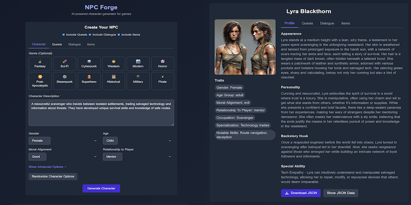
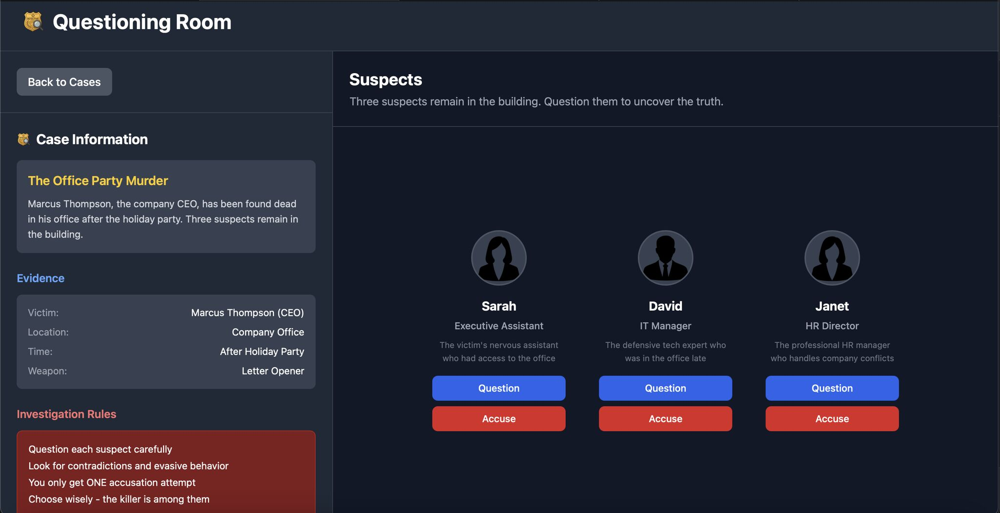
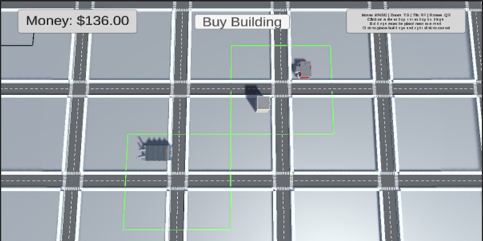
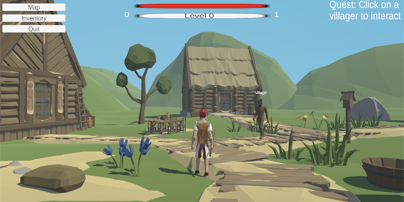
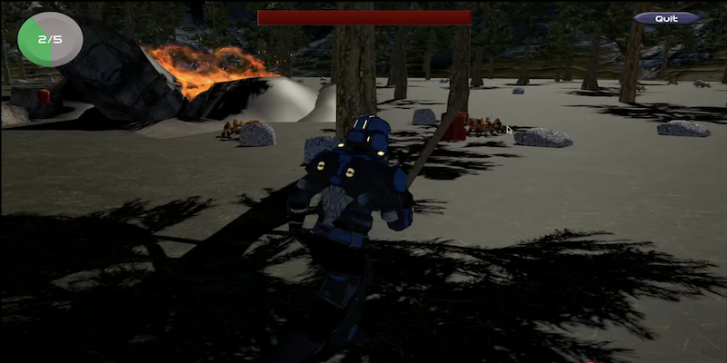

# 👋 Hi, I'm Ethan Perello
**Software Developer & Game Developer** specializing in AI-powered applications, game development, and interactive tools.

I create immersive experiences and developer tools that combine advanced AI capabilities with intuitive design, using Next.js, Unity, and cutting-edge AI APIs.

## 🏆 Flagship Project: NPC Forge

  

### **[NPC Forge](https://github.com/EthanPerello/npc-forge)** - AI Character Platform for Game Developers

A production-ready AI platform that revolutionizes character creation for game developers and storytellers. Generate detailed NPCs with personalities, quests, dialogue, and AI portraits, then chat with them in real-time. Built to solve the time-intensive process of creating rich, interactive characters for games and stories.

**🎮 Game Dev Features**: Character generation • AI portrait creation & editing • Interactive dialogue systems • Quest & item generation • JSON export for game integration • Real-time character chat for testing

**💻 Tech Stack**: Next.js 15, TypeScript, Tailwind CSS, 6+ OpenAI Models (GPT-4o, DALL-E 3, Image Editing, Chat Completion)

**📈 Impact**: 30+ feature releases • Production deployment • Comprehensive documentation • Advanced multi-model AI orchestration

**[🌐 Live Demo](https://npc-forge.vercel.app)** | **[📖 Documentation](https://npc-forge.vercel.app/docs)** | **[💬 Try Chat Feature](https://npc-forge.vercel.app/docs/chat)**

---

## 🎮 Featured Games

### Detective Game - Blockchain + AI Murder Mystery

  

**[GitHub](https://github.com/EthanPerello/detective-game)** | **[🎮 Play Now](https://detective-game-iota.vercel.app)**

A blockchain-first murder mystery game that combines AI-powered dialogue with provable on-chain mechanics. Built for Dojo Game Jam 6 ($25,000 prize pool), demonstrating innovative integration between expressive AI and blockchain transparency.

**🔗 Innovation**: Blockchain game state, AI-powered suspects, hybrid architecture  
**🎯 Gameplay**: Dynamic interrogations, single-accusation mechanic, case tracking  
**💻 Tech**: React, TypeScript, OpenAI GPT-4o, Dojo Engine, Starknet

---

### On-Chain City Builder - Blockchain Multiplayer Game

  

**[GitHub](https://github.com/EthanPerello/DojoCityBuilder)** | **[🎮 Play Now](https://ethanperello.github.io/DojoCityBuilder/)** | **[📺 Demo Video](https://www.youtube.com/watch?v=lORypXL-UwA)**

A groundbreaking multiplayer city simulation that integrates blockchain technology for persistent, verifiable gameplay. Players purchase land, construct buildings, and participate in a shared economy where all actions are recorded on-chain.

**🔗 Innovation**: Blockchain integration, persistent multiplayer state, decentralized ownership  
**🎯 Gameplay**: Real-time city building, economic simulation, strategic resource management  
**💻 Tech**: Unity, Dojo Engine, StarkNet, C#

---

### Medieval Fantasy RPG - Complex Systems RPG

  

**[GitHub](https://github.com/EthanPerello/MedievalFantasyRPG)** | **[🎮 Play Now](https://ethanperello.github.io/MedievalFantasyRPG/)**

A feature-rich 3D RPG showcasing sophisticated game systems and AI. Demonstrates mastery of character progression, inventory management, quest systems, and intelligent enemy AI in a cohesive fantasy world.

**⚔️ Systems**: Character progression, equipment-based stats, inventory management, quest tracking  
**🤖 AI**: NavMesh enemy AI, companion pets, finite state machines  
**💻 Tech**: Unity, C#, Blender, Custom Animation Controllers

---

### Space Adventure - Polished 3D Action Game

  

**[GitHub](https://github.com/EthanPerello/SpaceGame)** | **[🎮 Play Now](https://ethanperello.github.io/SpaceGame/)** | **[📺 Demo Video](https://www.youtube.com/watch?v=CufS2USIR1Y)**

A complete 3D action-adventure game built for Harvard's edX Game Development course. Showcases professional game development fundamentals with polished gameplay, UI, and game state management.

**🚀 Polish**: Complete game loop, professional UI, state management, win/lose conditions  
**🎯 Mechanics**: 3D movement, combat systems, collectibles, enemy AI  
**💻 Tech**: Unity, C#, 3D Physics, NavMesh AI

---

## 💻 Technical Skills
- **Game Development**: Unity, C#, 3D Physics, NavMesh AI, Animation Controllers, Game State Management
- **AI Integration**: OpenAI API (GPT-4, DALL-E, Image Editing), Multi-model orchestration, Prompt engineering
- **Web Development**: React/Next.js, TypeScript, Tailwind CSS, Node.js, IndexedDB
- **Blockchain**: Smart Contracts, Dojo/StarkNet, Cairo, Decentralized Storage
- **Languages**: JavaScript/TypeScript, C#, Python, C/C++, HTML/CSS, SQL
- **Tools**: Git, VS Code, Blender, Photoshop, Vercel, Docker

## 🌐 Connect & Explore
- **Portfolio**: [ethanperello.github.io](https://ethanperello.github.io)
- **LinkedIn**: [linkedin.com/in/EthanPerello](http://linkedin.com/in/EthanPerello)
- **Email**: ethanperello@gmail.com
- **NPC Forge**: [npc-forge.vercel.app](https://npc-forge.vercel.app)

---
I'm passionate about creating tools that empower game developers and building immersive interactive experiences. Always interested in collaborating on innovative projects that push the boundaries of game development, AI integration, and interactive technology.
